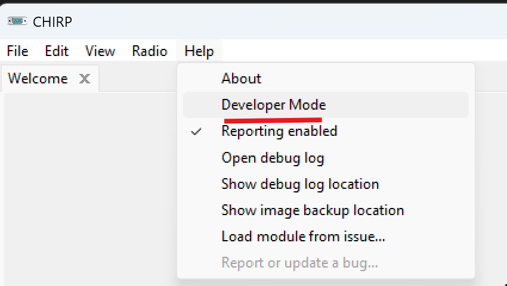
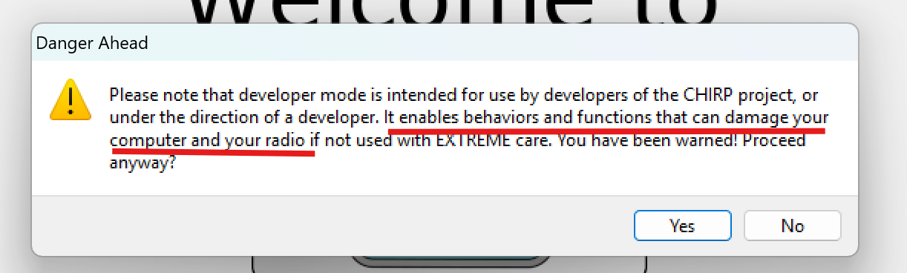
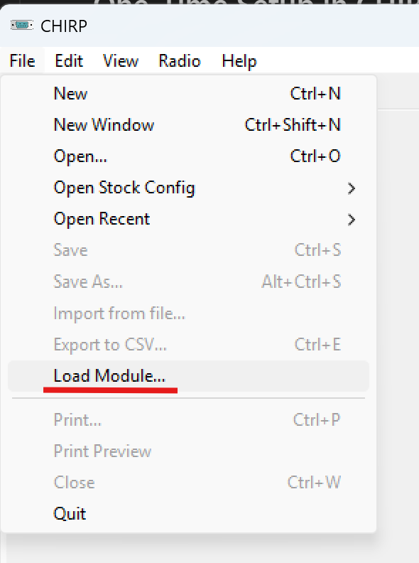
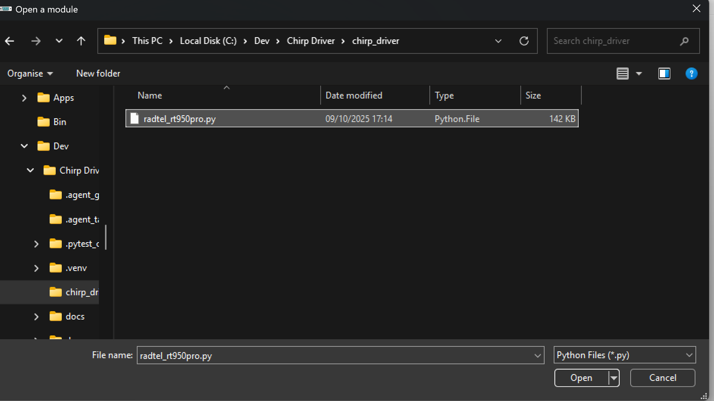
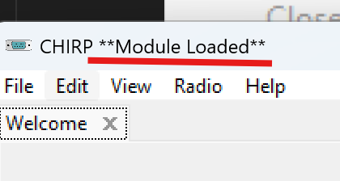
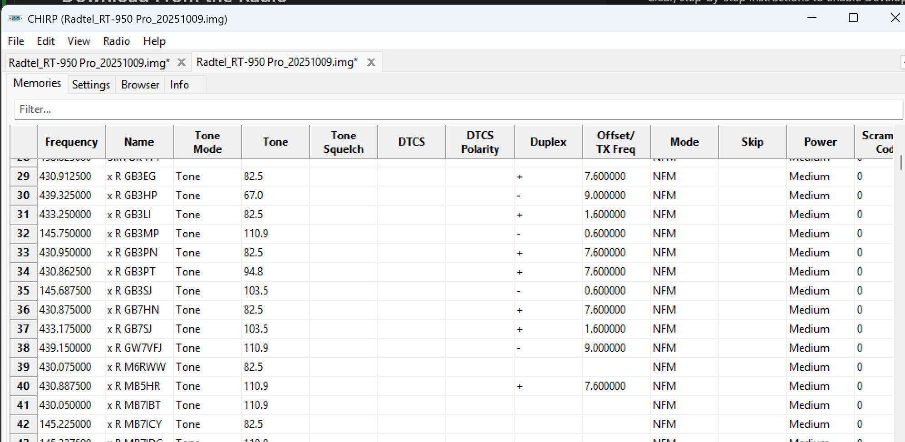
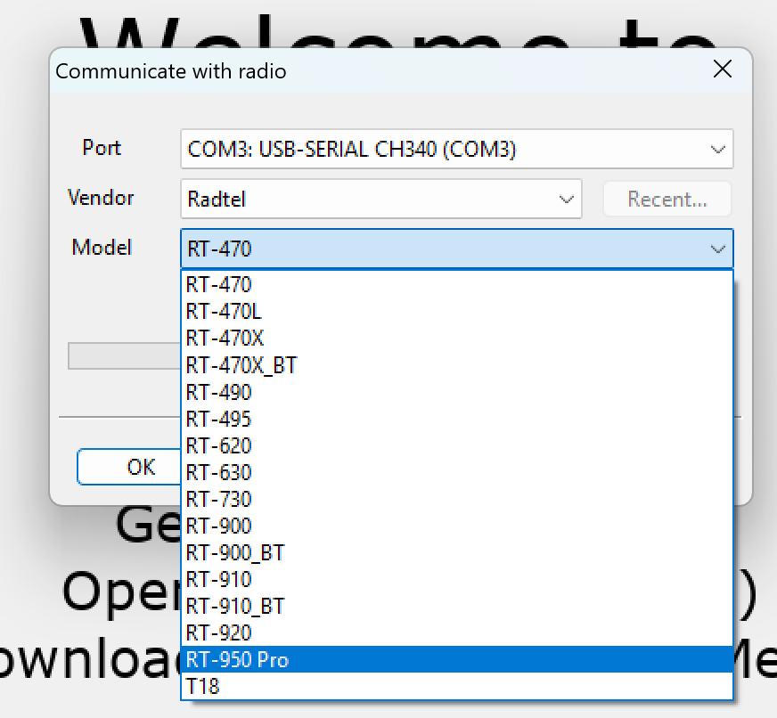

# Load the RT‑950 Pro Driver in CHIRP

This guide shows how to enable CHIRP’s developer mode, load the RT‑950 Pro driver module, and download from the radio. It also explains how to add screenshots so the page renders nicely on GitHub.

## Prerequisites
- CHIRP daily build (recommended).
- The driver file from this repo: `chirp_driver/radtel_rt950pro.py`.

## One‑Time Setup in CHIRP
1) Enable developer mode
   - In CHIRP, go to `Help` → `Enable Developer Mode`.
     
   - Confirm the warning dialog (click `Yes`).
     
   - Close and reopen CHIRP for the change to take effect.

2) Show extra fields
   - In CHIRP, go to `View` → `Show Extra Fields` and ensure it is checked.
   - This only needs to be set once.
## Load the Driver Module
1) In CHIRP, go to `File` → `Load Module…`.
   
2) A warning dialog will appear; accept it (click `Yes`).
3) Browse to the driver file (e.g., `chirp_driver/radtel_rt950pro.py`) you saved locally and click `Open` or `OK`.
   
4) CHIRP should indicate the module has been loaded (look for a banner or note in the title bar or status area).
   

Notes
- After the first successful load, developer mode and the extra fields setting persist; you do not need to repeat those steps each time.

## Download From the Radio
1) Turn on the radio and connect the programming cable (radio jack ↔ computer).
2) In CHIRP, go to `Radio` → `Download From Radio…`.
3) Select your serial `Port`, then set `Vendor` to `Radtel` and `Model` to `RT‑950 Pro` (or the name provided by the loaded module).
4) Click `OK` and wait for the read to complete.

   
   

 
## Adding Screenshots (for GitHub Preview)
This page references images under `docs/images`. To add or update screenshots:
- Save PNG/JPG files into `docs/images/` using short, hyphenated names (e.g., `file-load-module.png`).
- Use relative links in Markdown so GitHub renders them: ``.
- Recommended capture size: ~1200 px width (GitHub will scale down).
- Commit the images so they are included in the repo.

Example snippet
```

```

## Troubleshooting
- Load Module is missing
  - Ensure `Help` → `Enable Developer Mode` is enabled, then restart CHIRP.
- “This module may be unsafe” warning
  - Expected—click `Yes` to proceed when loading the module you trust.
- COM/Serial port not listed
  - Install the correct USB/serial drivers and replug the cable; on Windows note the COM number, on macOS/Linux find `/dev/tty.*`.
- Radtel RT‑950 Pro not listed after load
  - Re‑load the module via `File` → `Load Module…`, and confirm you selected the correct driver file.
- “Radio refused to enter clone mode” / timeouts
  - Check cable seating, radio power, correct port, and retry.

## Where Is the Driver File?
- Monolithic driver in this repo: `chirp_driver/radtel_rt950pro.py`.
- You can download just that file and point CHIRP’s “Load Module…” at it.
- If you build a monolith via tooling, use the generated `.py` file path instead.
